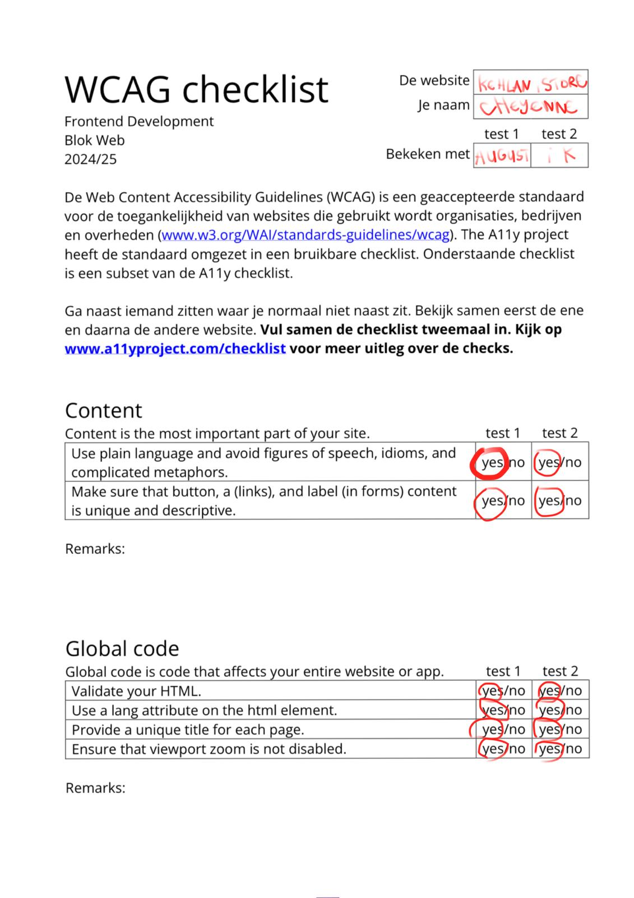
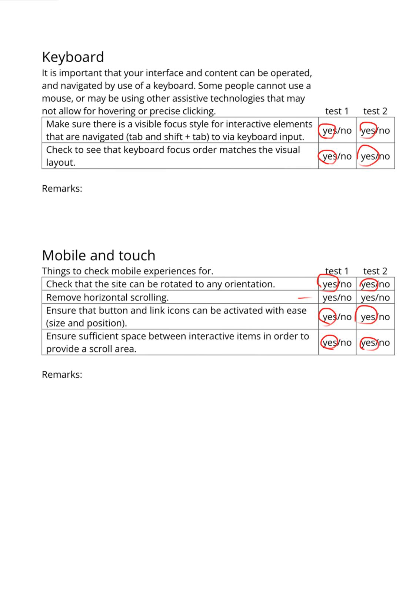
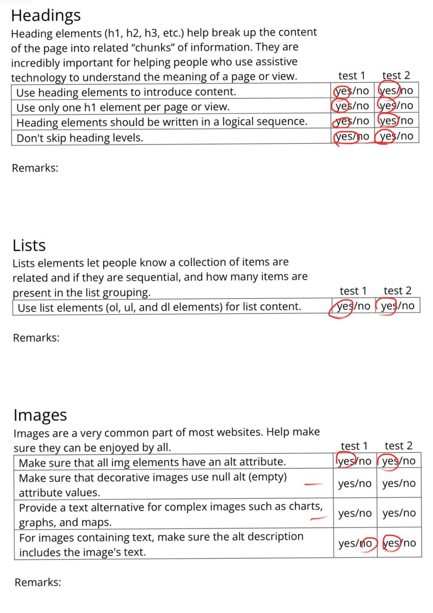
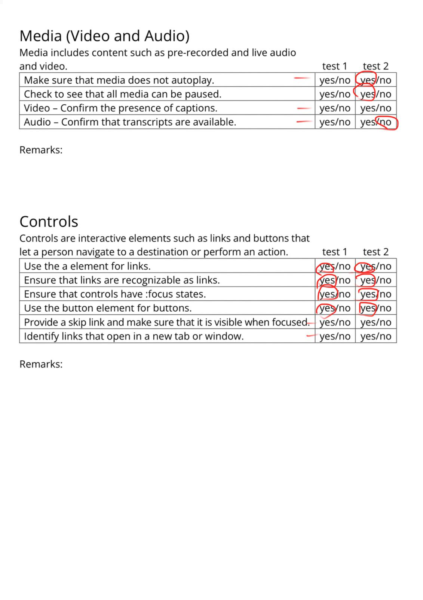
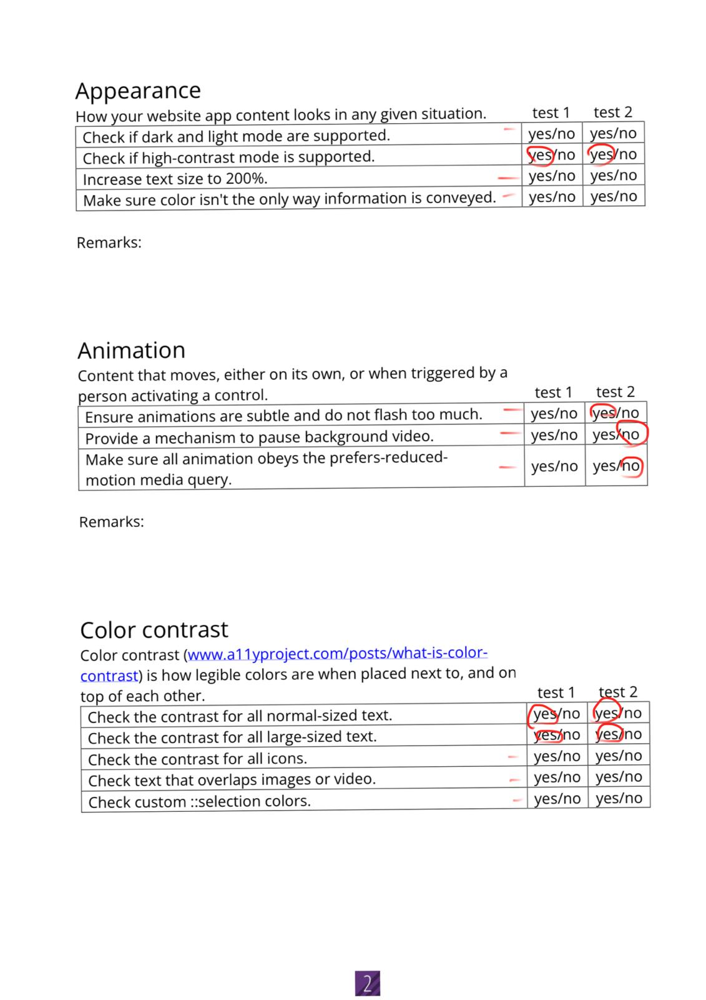
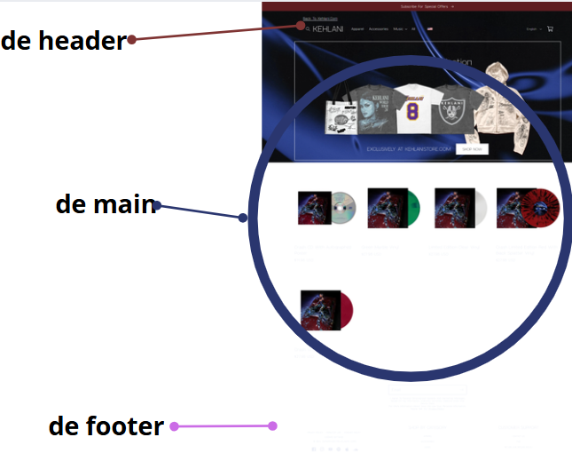
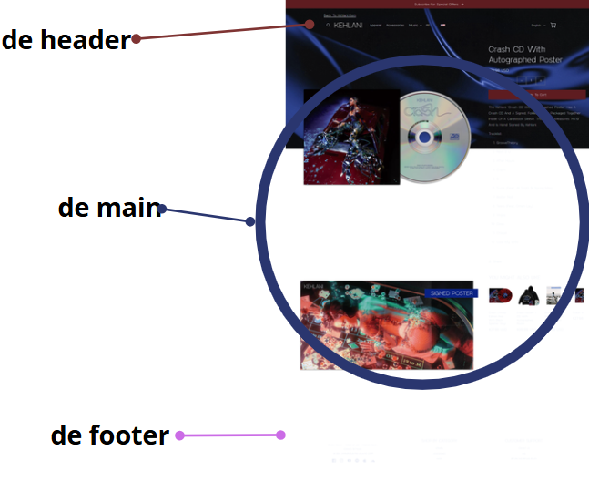
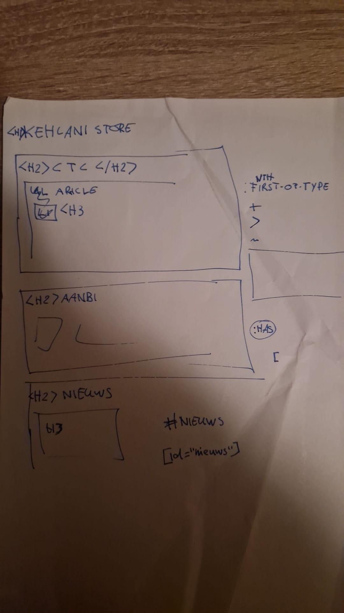
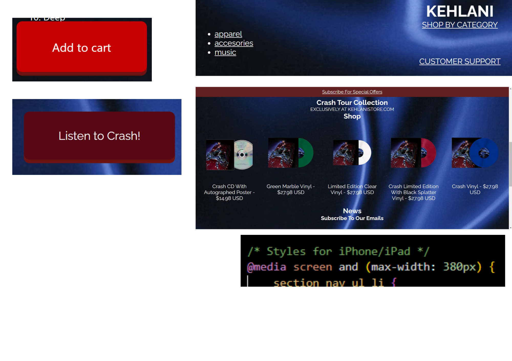

# Procesverslag
Markdown is een simpele manier om HTML te schrijven.  
Markdown cheat cheet: [Hulp bij het schrijven van Markdown](https://github.com/adam-p/markdown-here/wiki/Markdown-Cheatsheet).

Nb. De standaardstructuur en de spartaanse opmaak van de README.md zijn helemaal prima. Het gaat om de inhoud van je procesverslag. Besteedt de tijd voor pracht en praal aan je website.

Nb. Door *open* toe te voegen aan een *details* element kun je deze standaard open zetten. Fijn om dat steeds voor de relevante stuk(ken) te doen.

## Jij

  
uitwerken voor kick-off werkgroep

  ### Auteur:
 Cheyenne Nahar

  #### Je startniveau:
 Blauw

  #### Je focus:
 Surface (nou een beetje responsive ook eigenlijk)
 

## Je website

  
uitwerken voor kick-off werkgroep

  ### Je opdracht:
  (https://store.kehlani.com/)

  #### Screenshot(s) van de eerste pagina (small screen): 
  Kehlani store 
  

  #### Screenshot(s) van de tweede pagina (small screen):
   Kehlani store 
  
    
 

## Toegankelijkheidstest 1/2 (week 1)

  
uitwerken na test in 2e werkgroep

  ### Bevindingen
  Lijst met je bevindingen die in de test naar voren kwamen:

  Het was niet heel duidelijk waar bepaalde headers lagen, ik gokte natuurlijk wel gewoon dat KEHLANI de H1 was/is maar doordat het best klein is kan ik begrijpen dat dit makkelijk gemist kan worden.
  De site is overal eigenlijk niet slecht want je kan makkelijk door de tabs heengaan.
  Er zijn duidelijke buttons en duidelijke hints die aangeven wat wel een geen linkjes zijn.

  
   
  
  
  

## Breakdownschets (week 1)

  
uitwerken na afloop 3e werkgroep

  ### de hele pagina: 
  

  ### pagina 2: 
  

  ### voortgang schets: 
  

## Voortgang 1 (week 2)

  
uitwerken voor 1e voortgang

  ### Stand van zaken
  hier dit ging goed & dit was lastig (neem ook screenshots op van delen van je website en code)

  ### Agenda voor meeting
  samen met je groepje opstellen

  | student 1      | student 2          | student 3    | student 4        |
  | Cheyenne       | Mats               | Levon        | ---              |
  | dit bespreken  | en dit             | en ik dit    | en dan ik dat    |
  | en dat ook nog | dit als er tijd is | nog een punt | dit wil ik zeker |
  | ...            | ...                | ...          | ...              |
- Allemaal niet perse specifieke vragen

  ### Verslag van meeting
  hier na afloop snel de uitkomsten van de meeting vastleggen

  - Ik heb een betere uitwerking uitleg gekregen over hoe ik mijn html kan opbouwen omdat ik eerst teveel headers gebruikte (h1 tm 6 in plaats van de handigere manier waardoor ik nu h1 tm 3 gebruik.)
  - Ik kreeg een uitleg waarom de sections beter werken voor mijn opbouw.
  - Het was eigenlijk meer een structuur uurtje want elke student in mijn groepje kreeg eigenlijk het advies om goed te denken hoe je het beste kan werken in sections vooral voor de screenreader. 
  - Ik had wel vragen over hoe ik het beste kon werken met specifiek dingen aanroepen sinds we niet mochten/mogen werken met classes -> ik kreeg het advies om vooral te werken met nth's.
  - In de img bijlage vind je ook een screenshot met het advies hoe ik voor mijn site het beste kan sctructuren.

## Voortgang 2 (week 3)

  
uitwerken voor 2e voortgang

  ### Stand van zaken
  hier dit ging goed & dit was lastig (neem ook screenshots op van delen van je website en code)

  ### Agenda voor meeting
  samen met je groepje opstellen

  | student 1      | student 2          | student 3    | student 4        |
  | Cheyenne       | Mats               | Levon        | ---              |
  | dit bespreken  | en dit             | en ik dit    | en dan ik dat    |
  | en dat ook nog | dit als er tijd is | nog een punt | dit wil ik zeker |
  | ...            | ...                | ...          | ...              |
- Allemaal niet perse specifieke vragen

  ### Verslag van meeting
  hier na afloop snel de uitkomsten van de meeting vastleggen

  - Ik liep aan het begin van het gesprek vast bij het feit dat ik niet wist hoe ik mijn eind stuk van mijn main niet wist te verwerken -> ik wilde namelijk graag een uitklap systeem voor mijn shop by cat en cust support en werd dus aangestuurd om een article te gebruiken waarin ik een summary en details kan zetten waardoor het uitklap effect voorkwam. Dit was extreem hulpvol voor mijn proces in het maken van mijn page.
  - Ik liep ook vast bij hoe ik het beste mijn img en onderliggende tekst het beste samen kon vormgeven omdat ik zowel de img als de tekst wilde verwijzen naar de correct pagina.

## Toegankelijkheidstest 2/2 (week 4)

  
uitwerken na test in 9e werkgroep

  ### Bevindingen
  Lijst met je bevindingen die in de test naar voren kwamen (geef ook aan wat er verbeterd is): Tijdens het testen van mijn sites bleken mijn headers wel overzichtelijk te zijn. Hetzelfde gold voor de linkjes en buttons.

  
   
  
  
  

## Voortgang 3 (week 4)

  
uitwerken voor 3e voortgang

  ### Stand van zaken
  hier dit ging goed & dit was lastig (neem ook screenshots op van delen van je website en code)

  ### Agenda voor meeting
  samen met je groepje opstellen

  | student 1      | student 2          | student 3    | student 4        |
  | Cheyenne       | Mats               | Levon        | ---              |
  | dit bespreken  | en dit             | en ik dit    | en dan ik dat    |
  | en dat ook nog | dit als er tijd is | nog een punt | dit wil ik zeker |
  | ...            | ...                | ...          | ...              |
- Allemaal niet perse specifieke vragen

  ### Verslag van meeting/ na de meeting
  hier na afloop snel de uitkomsten van de meeting vastleggen/dagen na de meeting

  - Ik heb vooral gezeten met Mats eigenlijk omdat ik graag toch wat wilde doen met responsiveness naast werken aan de surface coding omdat ik het gevoel had dat ik te weinig had.
  - Ik had wel een probleem betreft mijn hover buttons tijdens het inspecteren maar tijdens het gesprek is dat snel opgelost en zijn mijn hover buttons functioneel zowel tijdens het inspecteren als niet tijdens het inspecteren.
  - Ik heb eigenlijk pas de dag later vervelende problemen gehad waaronder het feit dat mijn IMG totaal niet correct wilde sourcen tijdens het uploaden op Github terwijl ik tijdens het live zetten van mijn site via VSC geen foutmeldingen zag opkomen of slechte indicaties dat de pathing niet goedloopt. Ik heb met Ali heen en weer geappt en heb uiteindelijk ervoor gekozen om maar een nieuwe REPO aan te maken zodat ik gewoon helemaal fresh kan beginnen. Het was nogal vervelend dat ik het pas opmerkte na het voortgangsgesprek maar was nou eenmaal zo. Het is uiteindelijk wel gelukt met Ali maar tegen de tijd dat u dit leest weet u dat ik u ook een berichtje had gestuurd in poging tot hulp. 
  - Ik had ook heel erg last van het feit dat tijdens het oefenen met tabben de reader en de tab bar door elke gif heen wilde na die van mij en eigenlijk vast zat daar voor een aantal clicks en pas na een tijdje eigenlijk doorging met verdergaan door de volgende kopjes. Ik denk dat ik het nu heb opgelost maar het is nog heel vervelend bezig soms..
  -Tijdens het doorwerken realiseer ik me ook dat ik zonder GPT niet heel ver zou komen met die grid-temp want ik kan me er echt niet veel meer van herinneren ondanks het feit dat ik de opdrachten gewoon had gemaakt.
  

## Eindgesprek (week 5)

  
uitwerken voor eindgesprek

  ### Je uitkomst - karakteristiek screenshots:
  

  ### Dit ging goed/Heb ik geleerd: 
 - Ik heb geleerd om een mooiere hover button te maken door de scale  aan te passen!
 - Ik heb geleerd te werken met een article! (shop by category)
  -Ik heb een beetje leren werken met mijn site responsive maken
  -Ik heb een mooie nav kunnen maken met diverse producten

  

  ### Dit was lastig/Is niet gelukt:
  - Wat niet lukte was het feit dat zoals je ziet bij het plaatje met rode bolletjes ik helaas niet echt tijd of helemaal snapte hoe ik een winkelwagen kon toevoegen en die helemaal functioneel kon maken.
  -Ik had ook graag een beter formulier willen maken maar had gewoon snel eentje via CHATGPT laten uittypen alluwel ik weleens prceies zo eentje had gemaakt ergens anders in mijn codefiles.

  -Ik had in mijn shop nav balk eigenlijk wel een soort scrollbalk willen maken maar dat werkte uiteindelijk niet echt (het was eigenlijk meer voor de ipad en telefoon).

  -Ik had bij het plaatje van de CD eigenlijk een klikbare button willen maken waar je gewoon op 1 of 2 klikt en je naar de voor of achterkant kan kijken maar daar had ik niet echt tijd voor en t leek me een lang proces om uperhaubt eerst te begrijpen.

 - Ik had eigenlijk ook wel willen kijken naar als je tabt dat je ook de summary kan openen maar dacht daar te laat aan en vond het een bijzaak als we kijken naar al mijn problemen algelopen weken.

 
 

  

## Bronnenlijst

  
continu bijhouden terwijl je werkt

  Nb. Wees specifiek ('css-tricks' als bron is bijv. niet specifiek genoeg). 
  Nb. ChatGpT en andere AI horen er ook bij.
  Nb. Vermeld de bronnen ook in je code.

  1. Mijn Article - summary - detail structuur heb ik samen gemaakt met de studentassistente
  2. Mijn code voor de iframe komt zowel van de site: https://giphy.com/gifs/ykosiris-ride-yk-osiris-XdPiZg0XdMNGCGxvh7 als de correcte structuur zodat de foutmelding kon verdwijnen van ChatGPT
  3. Mijn  (html) Form voor de news mail komt van Chat GPT als vraagprompt: Maak een formulier voor mij waar je je mail kan zetten en kan submitten voor news
  4. Ik had een probleem tijdens het tabben door mijn site door de iframe gif dus heb daar een tabindex gezet met behulp van chat gpt want ik begreep niet waarom hij perse alle links moest voorlezen..
  5. Tijdens het maken van de media queries heb ik ChatGPT gevraagd me een beetje mee te helpen met het sctructeren en heb daarom als het gaat om de grid-templates het meest geluisterd naar de AI output en daarop verder gecodeerd tot het een beetje klopte qua px bij px en of bepaalde elementen zich anders moesten gedragen zoals gaan naar de center of volledig het scherm moesten innemen. 
  6. Mijn Javascript komt letterlijk uit mijn game website van vorig jaar van programmeren en is dus gecopypaste en daarna handmatig aangepast zodat het correct pastte binnen deze site.
  

